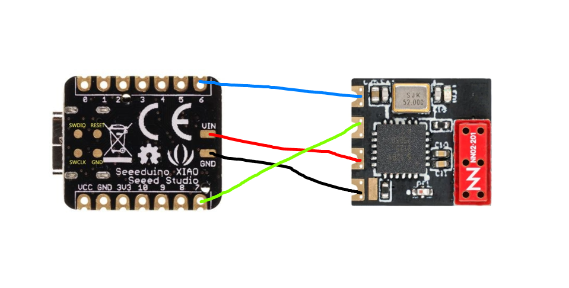
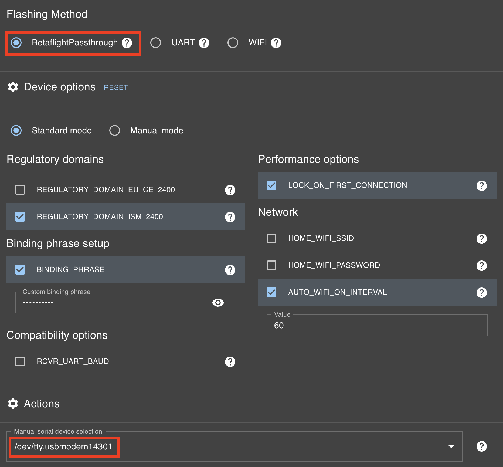

# ExpressLRS Joystick

Use your ExpressLRS radio as a joystick for your PC/Mac simulator using an 
Arduino microcontroller and the actual ExpressLRS receiver.

## Why this project?

To connect your radio as a joystick to your favourite simulator you basically limited
to the following options:

- Using USB wire
- [Bluetooth Joystick](https://oscarliang.com/expresslrs-bluetooth-joystick/)
- [Betaflight Joystick](https://oscarliang.com/betaflight-fc-fpv-simulator/)

This project provides another wireless connectivity option with the maximum rate of 500Hz (2ms).

## Hardware

- Microcontroller: Seeed Studio XIAO SAMD21
  - [Seeed Studio official site](https://www.seeedstudio.com/Seeeduino-XIAO-Arduino-Microcontroller-SAMD21-Cortex-M0+-p-4426.html)
  - [Amazon](https://a.co/d/ca6yMbT)
  - [Aliexpress](https://www.aliexpress.com/w/wholesale-Seeed-Studio-XIAO-SAMD21.html)

- Receiver: BETAFPV ExpressLRS Lite Receiver with Flat SMD Ceramic Antenna
  - [BETAFPV official site](https://betafpv.com/collections/expresslrs-series/products/elrs-lite-receiver?variant=39737264832646)
  - [Amazon](https://a.co/d/8Lx5IjT)
  - [Aliexpress](https://www.aliexpress.com/w/wholesale-BETAFPV-ExpressLRS-Lite-Receiver-with-Flat-SMD.html)

## Wiring diagram



## Flashing controller

Connect SAMD21 controller to the Mac via USB.
Wait for the Arduino disk to mount and the yellow led to light up on the board.

Validate board interface is available:
```bash
$ ls -l /dev/cu.usbmodem*
/dev/cu.usbmodem14301
```

The board is ready for the firmware upload.

The firmware requires [platformio](https://platformio.org/) framework
to be installed:
```bash
$ brew install platformio
```

To build and upload firmware use the following `make` commands:
```bash
$ make build
$ make upload
```

Once upload is done, Arduino disk will be forcefully unmounted and yellow led power off.
The microcontroller is now in the USB passthrough mode. In order to upload firmware
again, it requires to put board to [bootloader mode](https://wiki.seeedstudio.com/Seeeduino-XIAO/#enter-bootloader-mode).

## Flashing ExpressLRS receiver

Firmware supports direct flashing from the [ExpressLRS configurator](https://github.com/ExpressLRS/ExpressLRS-Configurator) using *BetaflightPassthrough* flashing method.




## Acknowledgments

Based on the following projects:
- https://github.com/pfeerick/USB_ELRS_Receiver
- https://qiita.com/kobatan/items/40728fbb625057d9f42b
- https://github.com/mikeneiderhauser/CRSFJoystick
